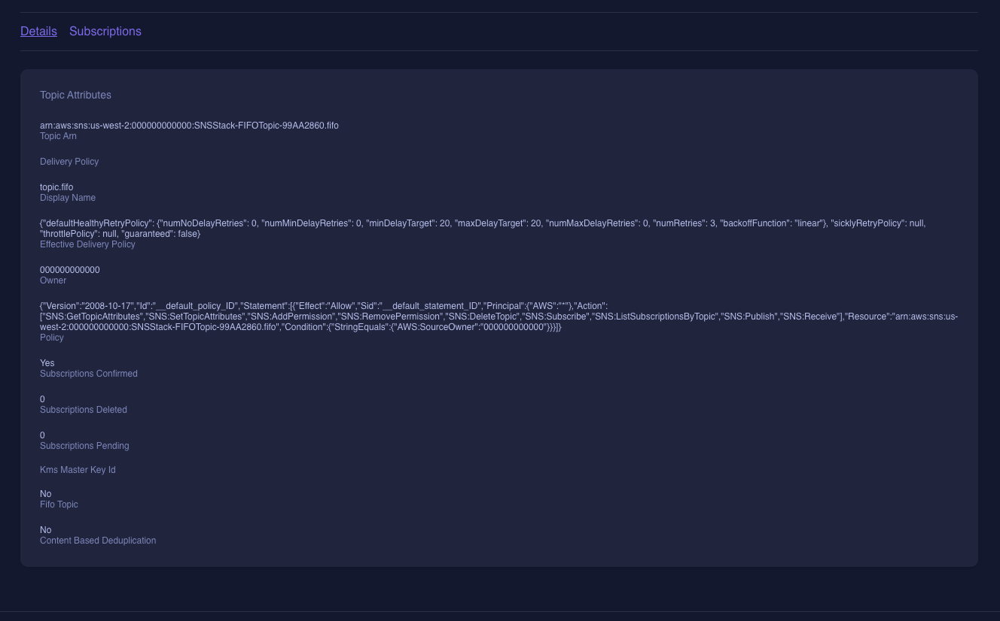

# ls-fifo-sns-cdk-bug

Quick repo to demonstrate bug when provisioning FIFO SNS in LocalStack via CDK.

## Bug Reproduction

_Assumes you have [LocalStack](https://docs.localstack.cloud/getting-started/installation/), [awscli-local](https://docs.localstack.cloud/user-guide/integrations/aws-cli/), and [cdklocal](https://docs.localstack.cloud/user-guide/integrations/aws-cdk/) installed._

- ### Start LocalStack

  ```shell
  localstack start -d
  ```

- ### Bootstrap CDK

  ```shell
  cdklocal bootstrap
  ```

- ### Deploy

  ```shell
  cdklocal deploy '*'
  ```

- ### Inspect the topic attributes

  - #### Using awslocal-cli

    - List the topics to get the ARN

      ```shell
      awslocal sns list-topics
      ```

    - Inspect topic attributes

      ```shell
      awslocal sns get-topic-attribute --topic-arn <topic-arn>
      ```

- #### Using LocalStack Desktop
  
